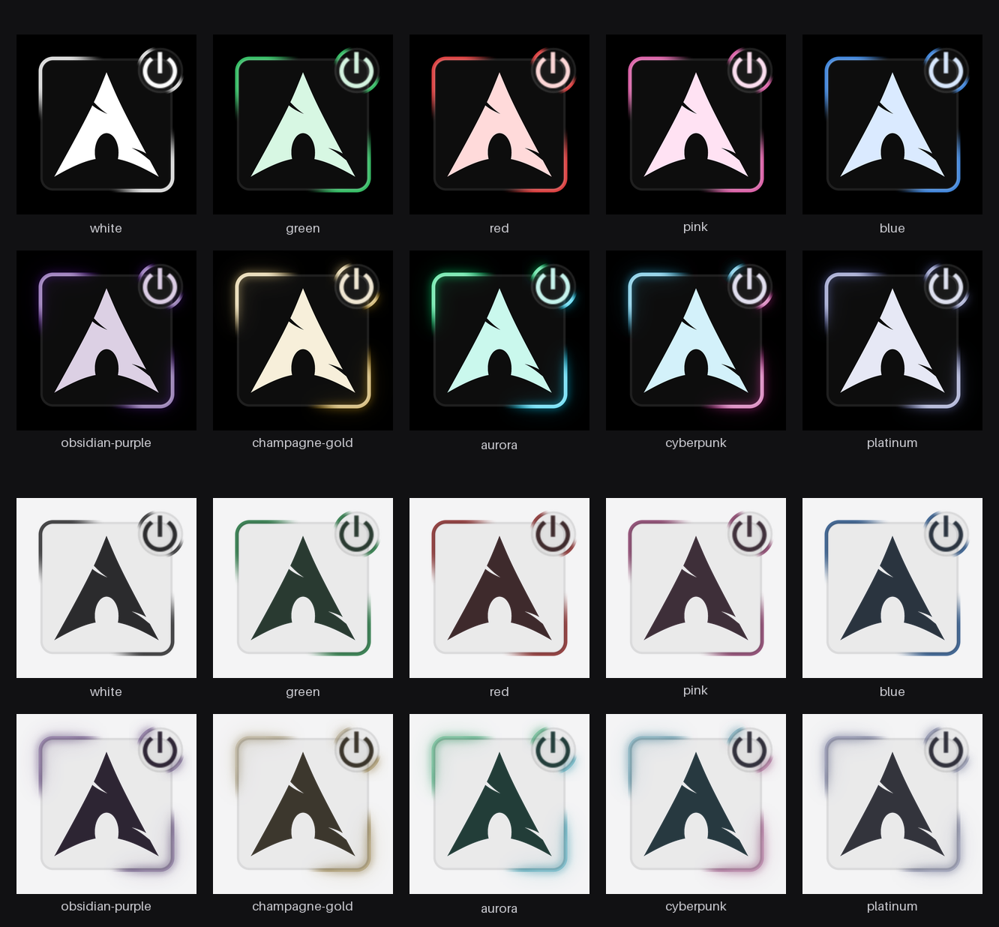
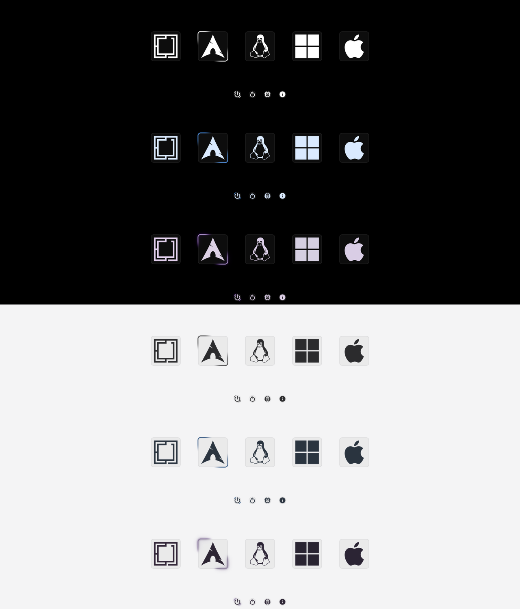

# Prism Minimal

A minimal [rEFInd](https://www.rodsbooks.com/refind/) boot theme. One solid
background, silhouette icons, no labels — icons always stay pure white (dark
ink on the light background), never tinted, and every one sits in its own
faint glass card (rounded square, barely-visible border and interior, same
shape on both rows, just smaller for the tools). Pick a colour and it lives
only in the selection: the entry you're about to boot gets a full,
always-solid orbital-arc ring on top of its card, whose outer glow pulses
smoothly around the loop — two hotspots per turn — rather than sitting flat.
The five premium gradients (below) sweep their hue around that same ring
instead of a flat colour, for a refined prism/iridescent look.





## Install

Two steps — pick colours, then install one of them:

```
git clone https://github.com/shoxjaxon-atabayev/refind-prism-minimal.git
cd refind-prism-minimal
./install.sh
```

No pre-built colour library is cloned — there's nothing bulky to fetch.
Running `./install.sh` with no `--color` and a terminal attached opens an
interactive picker:

```
Prism Minimal
─────────────

Select theme colours:

❯ ◉ White             the default — plain white / dark ink
  ◯ Aurora             premium gradient · emerald → cyan
  ◯ Solaris            premium gradient · amber → orange
  ◯ Rose Gold          premium gradient · pink → champagne
  ◯ Cyberpunk          premium gradient · magenta → cyan
  ◯ Platinum           premium gradient · cool grey → white
  ...

↑/↓ Navigate   Space Select   Enter Install
```

Toggle as many colours as you like with Space, Enter to confirm. This
**generates the ones you picked** (needs **Python 3 + Pillow + numpy** — the
installer checks for these first) into `build/colors/` inside this checkout
and stops there — **nothing is installed to rEFInd yet**, and this step
never asks for your password (it never touches the EFI partition).

Then install the one you actually want:

```
./install.sh --color platinum
```

This reuses what the picker already generated — no regenerating. It's what
asks for your password (writing the EFI partition needs root), and it fully
replaces whatever colour was installed before (no old copy kept around).
**Reboot** to see it.

Skip the picker entirely by naming a colour straight away — if it isn't
already in `build/colors/`, this generates just that one first:

```
./install.sh --color blue
```

## Change the colour

```
./install.sh --color blue
./install.sh --color obsidian-purple
```

Colours: `white` `green` `red` `pink` `blue`
`obsidian-purple` `champagne-gold` `aurora` `cyberpunk` `platinum`
&nbsp;&nbsp;*(`obsidian-purple`/`champagne-gold` shimmer;
`aurora`/`cyberpunk`/`platinum` are premium
gradients for the dark background)*

An unknown colour name warns and falls back rather than aborting the
install:

```
⚠ Unknown color: mauve
  Available colors: white green red pink ...
```

Run `./install.sh --list` to see every colour and its note.

## Change the background

```
./install.sh --background light
./install.sh --background dark
```

`dark` is black (default), `light` is near-white (icons and the selection arc
turn dark so they stay readable).

## Combine them

```
./install.sh --color champagne-gold --background light
```

Re-run with different options any time to switch — it only swaps the images,
nothing else. Run `./install.sh --list` to see every option.

## Remove it

```
./install.sh --uninstall
```

Puts `refind.conf` back the way it was.

## All commands

| command | what it does |
|---|---|
| `./install.sh` | pick colours to generate (no install yet) |
| `./install.sh --color <name>` | install `<name>` now, skipping the picker |
| `./install.sh --background <dark\|light>` | pick a background (short: `--bg`) |
| `./install.sh --list` | list the colours and backgrounds |
| `./install.sh --uninstall` | remove the theme, restore `refind.conf` |
| `./install.sh --dry-run` | show what would happen, change nothing |
| `./install.sh --yes` | don't ask for confirmation |
| `./install.sh --refind-dir <path>` | if it can't find rEFInd, point it at the folder with `refind.conf` |
| `./install.sh --deploy-refind` | if rEFInd itself isn't installed, set it up first |

## Notes

* **rEFInd must already be installed.** If it isn't, `./install.sh` stops and
  tells you what to run (`sudo refind-install`), or pass `--deploy-refind` and
  it does that step for you.
* **Needs Python 3 + Pillow + numpy** to generate the colour you pick. The
  installer checks for these up front and tells you exactly what's missing.
* **Safe to re-run.** It only ever touches `themes/prism-minimal/` on your EFI
  partition and one marked block in `refind.conf` (backed up first). It never
  touches boot entries, Secure Boot, or other bootloaders.
* **Installing always fully replaces the previous colour** — no `.previous`
  backup is kept, so re-styling repeatedly doesn't slowly fill up your EFI
  partition.
* `build/colors/` (inside this checkout) is where generated colours live
  between the two steps. It's gitignored, never committed, and safe to
  delete any time — `./install.sh --color <name>` just regenerates whatever
  it needs.
* If a theme file ever goes missing, rEFInd just falls back to its built-in
  look — you never get a broken boot menu.

## Manual install (no script)

There's no pre-built `colors/` folder to copy from — generate the look you
want first, then place it by hand:

1. `python3 tools/generate.py <colour> --out-dir=/tmp/prism-look` (needs
   Pillow + numpy — `pip install Pillow numpy` if you don't have them).
2. Copy this repo's folder to `<your EFI partition>/EFI/refind/themes/prism-minimal/`.
3. Copy files over the ones at the top of that folder:
   * `backgrounds/dark.png` **or** `backgrounds/light.png` → `background.png`
   * from `/tmp/prism-look/<colour>/` (dark bg) or
     `/tmp/prism-look/<colour>/light/` (light bg): `selection_big.png`,
     `selection_small.png`, and the whole `icons/` folder
4. Add one line to `refind.conf`:

   ```
   include themes/prism-minimal/theme.conf
   ```

## Developing

`tools/generate.py` builds every `<out>/<name>/` (and `<out>/<name>/light/`)
from `icons/` plus the constants at the top of the file — colours,
backgrounds, icon padding, iridescence. `install.sh` always points `<out>`
at `build/colors/` in this checkout (its persistent cache); running the
generator directly with no `--out-dir` uses that same `build/colors/` and
also rewrites the committed `backgrounds/dark.png` / `backgrounds/light.png`
(harmless — they're deterministic solid fills).

```
python3 tools/generate.py                       # rebuild everything into build/colors/
python3 tools/generate.py blue red               # just some colours
python3 tools/generate.py --list                 # print available colour names
python3 tools/generate.py --preview               # also rebuild preview*.png
python3 tools/generate.py white --out-dir=/tmp/x  # build one colour elsewhere
```

Then re-sync the repo's default copies (used by `--help`/docs and as a
manual-install fallback — not read by `install.sh`, which reads straight
from `build/colors/`):

```
cp backgrounds/dark.png background.png
cp build/colors/white/selection_big.png selection_big.png
cp build/colors/white/selection_small.png selection_small.png
```

## Credits

Icons and base layout from
[rEFInd-minimal](https://github.com/EvanPurkhiser/rEFInd-minimal) by Evan
Purkhiser. The colour / background system and the installer are new here.
